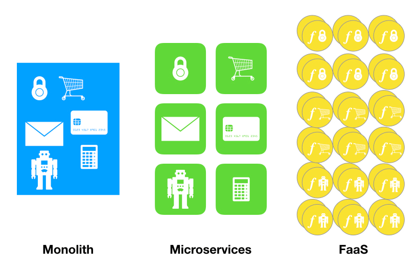
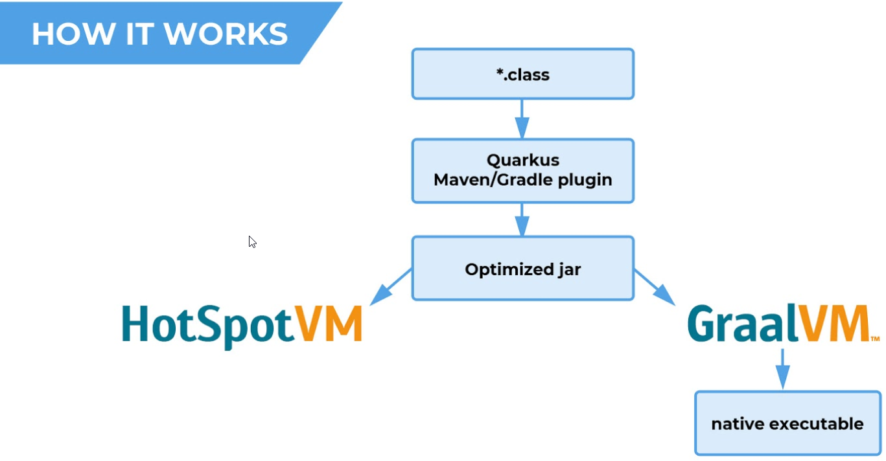
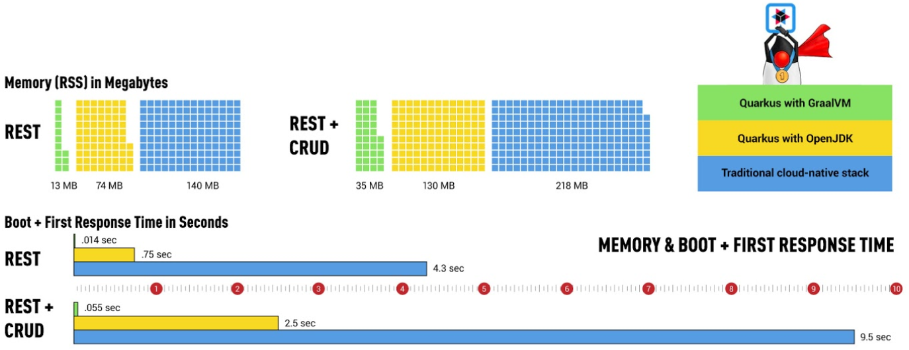

# Java container optimization

---

## Scope

--


<span class="fragment">

</span>

<aside class="notes">
Legacy
New One (microservice)
</aside>

---

## Goal

--



--

Do more with less! {.fragment .highlight-red}

* CPU {.fragment .fade-right}
* Memory footprint {.fragment .fade-right}
* IO {.fragment .fade-right}
* Security {.fragment .fade-right}


---

## Summary

--

### Container


--

### JVM


--

### Framework


--


---

## Container

--

### Sizing

* Disk storage {.fragment .fade-right}
  * Registry
  * Host
* Download performance {.fragment .fade-right}
  * quick launch

<aside class="notes">
* Layer duplication
* automatic pull of base image
* quick startup 
</aside>

--

### Security

--

> "An image should only include the executable and libraries required by the app itself; all other OS functionality is provided by the OS kernel within the underlying host OS." -**NIST**-

--

* Attack surface vulnerability are limited
* Container immutability is guarantee {.fragment .fade-right}
* Secure secret variables unreachable {.fragment .fade-right}

<aside class="notes">
* no manual connection into a container
* no remote connection, no shell, no exposition
</aside>

--

### Strategies

--

#### Small base image

--

<iframe src="https://docs.google.com/spreadsheets/d/e/2PACX-1vTlum2-EkQbcQiR0xuJAatsmiub8ky3MH8ZIjfVT-ZI6Iw2rwisZ9yolP1HPWhLX22afu22EVUUVLOd/pubhtml?gid=1361748970&single=true" style="border:0px #ffffff none;" name="Distribution" scrolling="no" frameborder="0" marginheight="0px" marginwidth="0px" height="600px" width="800px" allowfullscreen></iframe>

--

<iframe src="https://docs.google.com/spreadsheets/d/e/2PACX-1vTlum2-EkQbcQiR0xuJAatsmiub8ky3MH8ZIjfVT-ZI6Iw2rwisZ9yolP1HPWhLX22afu22EVUUVLOd/pubhtml?gid=12271636&single=true" style="border:0px #ffffff none;" name="Distribution" scrolling="no" frameborder="0" marginheight="0px" marginwidth="0px" height="800px" width="1000px" allowfullscreen></iframe>

--

<iframe src="https://docs.google.com/spreadsheets/d/e/2PACX-1vTlum2-EkQbcQiR0xuJAatsmiub8ky3MH8ZIjfVT-ZI6Iw2rwisZ9yolP1HPWhLX22afu22EVUUVLOd/pubchart?oid=1977800902&format=interactive" style="border:0px #ffffff none;" name="Distribution" scrolling="no" frameborder="0" marginheight="0px" marginwidth="0px" height="400px" width="1100px" allowfullscreen></iframe>

--

#### Final image optimization

--

[Docker-slim](https://github.com/docker-slim/docker-slim)

* Since December 2014 {.fragment .fade-right}
* 8 active contributors {.fragment .fade-right}

--

```bash
TODO
```

--

Project             | Parent     | origin  | slim  |  x   |
-------------       |------------|-------- | ------|---   |
Keycloak Gatekeeper | CentOS     | 200     | 20    |  10  |
Keystore            | Distroless | 78.8    | 65.3  |  1.2 |
^^                  | CentOS     | 248     | 65.7  |  3.8 |

--

distribution agnostic {.fragment .fade-right}
{.fragment .highlight-green}
 
reduce surface attack {.fragment .fade-right}
{.fragment .highlight-green}
 
parent contagion {.fragment .fade-right}
{.fragment .highlight-green}

scanner detection {.fragment .fade-right}
{.fragment .highlight-red}  

<aside class="notes">
snyk
trivy      
</aside>

--

#### Conclusion

Distroless {.fragment .fade-in-then-out}

docker-slim {.fragment .fade-in-then-out}

 {.fragment .fade-in-then-semi-out"}

---

## JVM


--

### OpenJDK


--

### OpenJDK Hotspot

free and open-source implementation of Java SE. {.fragment .fade-right}

--

#### Container friendly

* \> 8u131 {.fragment .fade-in-then-out}
* \> 8u191 {.fragment .fade-right}
* Java 11 {.fragment .fade-right}
  
<aside class="notes">
current 7/2019 8u222
to disable: -XX:-UseContainerSupport
HotSpot, released as Java HotSpot Performance Engine,[1] is a Java virtual machine for desktop and server computers, maintained and distributed by Oracle Corporation. It features improved performance via methods such as just-in-time compilation and adaptive optimization.
</aside>

--

### Eclipse OpenJ9

high performance, scalable, JVM implementation that is fully compliant with the Java Virtual Machine Specification. {.fragment .fade-right}

* JDK 8-11 {.fragment .fade-right}
* Container friendly {.fragment .fade-right}
* Class Data Sharing
* Dynamic Ahead-Of-Time
* Startup mode (quick, virtualized)

<aside class="notes">
dAOT Update Shared Class Cache at runtime. Runs once, benefit to others.
Just as with JIT compilations, the compiler only AOT compiles methods that have been executed a certain number of times.
</aside>

--

### GraalVM

next generation Hotspot VM.

--

* Platform
* Polyglot {.fragment .fade-right}
* Graal Compiler {.fragment .fade-right}
* Community / Enterprise edition

<aside class="notes">
"client", aussi nommé "C1". Il est utilisé pour les applications desktop, ayant une faible durée de vie (comptée en heures).  Dans ce mode, la JVM démarre plus rapidement mais n’effectue que peu d’optimisations sur le code et a pour objectif de ne pas utiliser beaucoup de ressources matérielles.

"server", aussi appelé "C2" ou "opto". Il est utilisé sur les serveurs, pour lesquels la durée de vie est bien plus longue (comptée en jours). Dans ce mode, la JVM démarre plus lentement compte tenu des optimisations effectuées pour atteindre le point d’équilibre.  La limitation sur les ressources matérielles du mode client n’existe plus ici : toutes les optimisations possibles sont activées.
Java replacement of C2 C++: long time performance)
Polyglot -> Truffle -> python, java, rust, NodeJS
</aside>

--

Native image

{.fragment .fade-right}

* library {.fragment .fade-right}
* full {.fragment .fade-right}

<aside class="notes">
Native image -> Static Ahead Of Time with Substrate VM
</aside>

--

### LTS/ Production Ready

* JDK 8: Q3 2023 {.fragment .fade-right}
* JDK 11: Q4 2022-2024 {.fragment .fade-right}
* JDK 17: init Q3 2021 {.fragment .fade-right}
* GraalVM: init 2019 {.fragment .fade-right}

v19 support 8 only, 11 work in progress  {.fragment .fade-right}  
  
<aside class="notes">
[Support](https://docs.google.com/spreadsheets/d/e/2PACX-1vTlum2-EkQbcQiR0xuJAatsmiub8ky3MH8ZIjfVT-ZI6Iw2rwisZ9yolP1HPWhLX22afu22EVUUVLOd/pubhtml?gid=1089879229&single=true)
cycle de 3 ans
</aside>

--

### Performance

--

#### Methods

--

* Differents use cases:
  * Stream only
  * Microprofile
  * SpringBoot
  * RH-SSO 7.3

--

* **Two** automatic measures:
  * Start time o process time
  * Memory
  * Latency (mean, 50%, 90%)
  * Throughput

--

#### Results

--

<iframe src="https://docs.google.com/spreadsheets/d/e/2PACX-1vTlum2-EkQbcQiR0xuJAatsmiub8ky3MH8ZIjfVT-ZI6Iw2rwisZ9yolP1HPWhLX22afu22EVUUVLOd/pubhtml?gid=338344574&single=true" style="border:0px #ffffff none;" name="Stream" scrolling="no" frameborder="0" marginheight="0px" marginwidth="0px" height="600px" width="1000px" allowfullscreen></iframe>

--

<iframe src="https://docs.google.com/spreadsheets/d/e/2PACX-1vTlum2-EkQbcQiR0xuJAatsmiub8ky3MH8ZIjfVT-ZI6Iw2rwisZ9yolP1HPWhLX22afu22EVUUVLOd/pubhtml?gid=898376284&single=true" style="border:0px #ffffff none;" name="Microprofile" scrolling="no" frameborder="0" marginheight="0px" marginwidth="0px" height="600px" width="1000px" allowfullscreen></iframe>

--

<iframe src="https://docs.google.com/spreadsheets/d/e/2PACX-1vTlum2-EkQbcQiR0xuJAatsmiub8ky3MH8ZIjfVT-ZI6Iw2rwisZ9yolP1HPWhLX22afu22EVUUVLOd/pubhtml?gid=1814932109&single=true" style="border:0px #ffffff none;" name="Spring Boot" scrolling="no" frameborder="0" marginheight="0px" marginwidth="0px" height="600px" width="1000px" allowfullscreen></iframe>

--

<iframe src="https://docs.google.com/spreadsheets/d/e/2PACX-1vTlum2-EkQbcQiR0xuJAatsmiub8ky3MH8ZIjfVT-ZI6Iw2rwisZ9yolP1HPWhLX22afu22EVUUVLOd/pubhtml?gid=166042169&single=true" style="border:0px #ffffff none;" name="Distribution" scrolling="no" frameborder="0" marginheight="0px" marginwidth="0px" height="300px" width="600px" allowfullscreen></iframe>

--

<iframe src="https://docs.google.com/spreadsheets/d/e/2PACX-1vTlum2-EkQbcQiR0xuJAatsmiub8ky3MH8ZIjfVT-ZI6Iw2rwisZ9yolP1HPWhLX22afu22EVUUVLOd/pubhtml?gid=2071947112&single=true" style="border:0px #ffffff none;" name="Distribution" scrolling="no" frameborder="0" marginheight="0px" marginwidth="0px" height="300px" width="600px" allowfullscreen></iframe>

--

**OpenJDK 8** {.fragment .highlight-red}

**OpenJDK 11** {.fragment .highlight-green}

**OpenJ9**  {.fragment .highlight-blue}  

**GraalVM** 

<aside class="notes">
OpenJDK 8: deprecated
OpenJDK 11: default
OpenJ9: focus on memory usage
GraalVM: wait to see (OpenJDK integration)
</aside>

--

### Custom JRE

--

#### Java Platform Module System

--

```bash
# JDK11
sdk use java 11.0.4.j9-adpt && du -hcs  $JAVA_HOME
# 300M    /java/11.0.4.j9-adpt
# Compile
javac CountUppercase.java
# Deps
jdeps --print-module-deps CountUppercase.class
# Generate distribution
jlink --no-header-files --no-man-pages --compress=2 --strip-debug \
 --add-modules  $(jdeps --print-module-deps CountUppercase.class) \
 --output java-base
# Custom distribution
ls java-base/ && du -hcs
# bin  conf  legal  lib  release -> 39M     java-base/
JAVA_HOME=$PWD/java-base>
```

<aside class="notes">
30MB instead of 116MB ( JRE size) and 320MB for a full JDK.
</aside>

---

## Java native frameworks

**Native?** {.fragment .fade-right}

--

 {.fragment .fade-in-then-out}

{.fragment .fade-in-then-semi-out"}

--

### Candidates

--

<iframe src="https://docs.google.com/spreadsheets/d/e/2PACX-1vTlum2-EkQbcQiR0xuJAatsmiub8ky3MH8ZIjfVT-ZI6Iw2rwisZ9yolP1HPWhLX22afu22EVUUVLOd/pubhtml?gid=675234315&single=true" style="border:0px #ffffff none;" name="Stream" scrolling="no" frameborder="0" marginheight="0px" marginwidth="0px" height="500px" width="700px" allowfullscreen></iframe>


<aside class="notes">
Krihelimeter = 	20	 * authors +
8	 * merged and proposed pull requests +
8	 * new and closed issues +
1	 * commits
alternative : spark https://www.e4developer.com/2018/06/02/the-rise-of-java-microframeworks/
</aside>

--

<script type="text/javascript" src="https://ssl.gstatic.com/trends_nrtr/1937_RC01/embed_loader.js"></script> <script type="text/javascript"> trends.embed.renderExploreWidget("TIMESERIES", {"comparisonItem":[{"keyword":"quarkus","geo":"","time":"today 12-m"},{"keyword":"helidon","geo":"","time":"today 12-m"},{"keyword":"micronaut","geo":"","time":"today 12-m"}],"category":5,"property":""}, {"exploreQuery":"cat=5&q=quarkus,helidon,micronaut&date=today 12-m,today 12-m,today 12-m","guestPath":"https://trends.google.com:443/trends/embed/"}); </script> 

--

#### Code

--

* Micronaut vs Quarkus

```diff
-import io.micronaut.http.annotation.Controller;
+import javax.inject.Inject; 
 
-@Controller("/conferences") 
+@Path("/conferences")
+@Produces(MediaType.APPLICATION_JSON)
 public class ConferenceController {
-    private final ConferenceService conferenceService;
+    @Inject
+    private ConferenceService conferenceService;
-    public ConferenceController(ConferenceService conferenceService) {
-        this.conferenceService = conferenceService;
-    }
-    @Get("/random") 
-    public Conference randomConf() { 
+    @Path("/random")
+    @GET
+    public Conference randomConf() { 
         return conferenceService.randomConf();
     }
 }
```

--

* Quarkus vs Spring

```diff
-import io.micronaut.http.annotation.Controller;
+import org.springframework.web.bind.annotation.RequestMapping;
 
-@Controller("/conferences") 
+@RestController
 public class ConferenceController {
+    @Autowired
+    private ConferenceService conferenceService;
-    private final ConferenceService conferenceService;
-    public ConferenceController(ConferenceService conferenceService) { 
-        this.conferenceService = conferenceService;
-    }
-
-    @Get("/random") 
-    public Conference randomConf() { 
+    @RequestMapping("/conferences/random")
+    public Conference randomConf() {
         return conferenceService.randomConf();
     }
 }

``` 

<aside class="notes">
https://github.com/malys/Native_Java_Framework/compare/quarkus...master
https://github.com/malys/Native_Java_Framework/compare/quarkus...spring

https://api.github.com/repos/malys/Native_Java_Framework/compare/master...quarkus
</aside>


--

#### Performance

--

<iframe src="https://docs.google.com/spreadsheets/d/e/2PACX-1vTlum2-EkQbcQiR0xuJAatsmiub8ky3MH8ZIjfVT-ZI6Iw2rwisZ9yolP1HPWhLX22afu22EVUUVLOd/pubhtml?gid=2096152561&single=true" style="border:0px #ffffff none;" name="Stream" scrolling="no" frameborder="0" marginheight="0px" marginwidth="0px" height="300px" width="700px" allowfullscreen></iframe>

<aside class="notes">
https://github.com/malys/Native_Java_Framework/compare/quarkus...master
https://github.com/malys/Native_Java_Framework/compare/quarkus...spring

https://api.github.com/repos/malys/Native_Java_Framework/compare/master...quarkus
</aside>


--

#### Quarkus

Supersonic Subatomic Java

--



--


